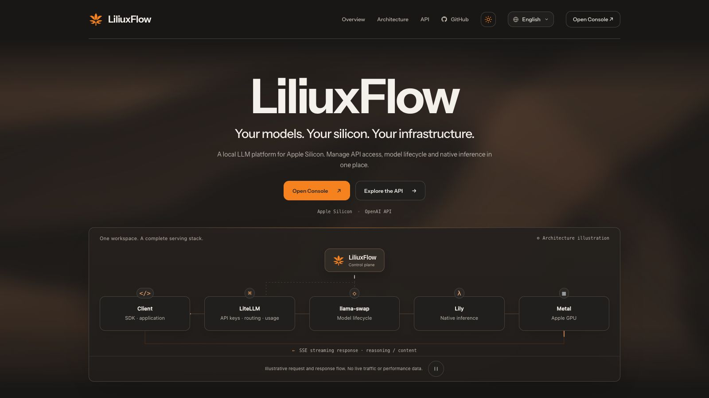
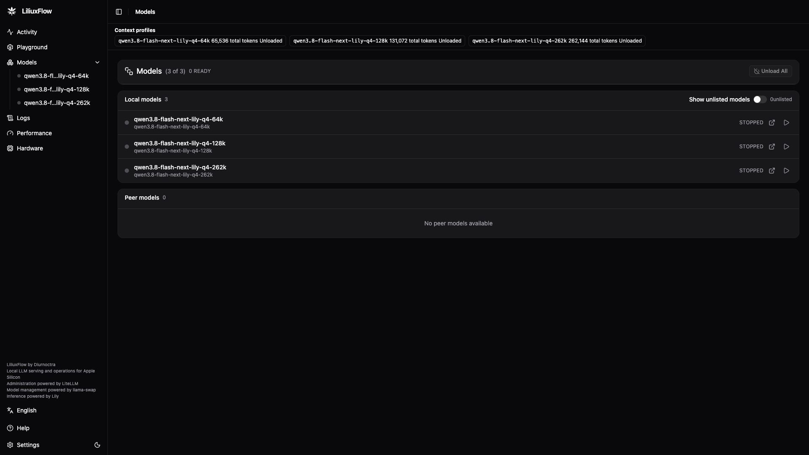

<p align="center"><picture><source media="(prefers-color-scheme: dark)" srcset="assets/brand/mark-dark.svg"></picture></p>
<h1 align="center">LiliuxFlow</h1>
<p align="center">Local LLM serving and operations for Apple Silicon.</p>
<p align="center">
  <a href="https://github.com/Hiruynk/LiliuxFlow/releases"></a>
  <a href="#requirements"></a>
  <a href="#requirements"></a>
  <a href="LICENSE"></a>
</p>

<p align="center"><strong>English</strong> · <a href="README.zh-Hant.md">繁體中文</a> · <a href="README.zh-Hans.md">简体中文</a> · <a href="README.ja.md">日本語</a></p>

## About the Project

LiliuxFlow is a native local LLM serving and operations platform for Apple Silicon. It brings Lily inference, LiteLLM API access management and llama-swap model lifecycle management into one deployable stack, with multilingual dashboards and a compatibility layer for existing applications. It is designed for developers who want to connect applications to a local model and manage the service from their Mac.

LiliuxFlow adds service orchestration, request-aware lifecycle protection and protocol adaptation around these components. A single workflow prepares the native runtime, gives applications their own API keys, coordinates model loading and cancellation, and provides tools for routine maintenance. Management is powered by LiteLLM, model processes are managed by llama-swap, and inference runs on Lily.

## Highlights

- **Native deployment.** Build and run the serving stack using native Rust/Metal, Python, Go and PostgreSQL. A macOS user LaunchAgent supervises the services; the installation keeps its settings, credentials and runtime data in a dedicated directory.
- **API access for your applications.** Use LiteLLM virtual keys, model permissions, usage tracking and rate limits to manage each application's access. Connect Chat Completions clients to a local API base with a model name and their own key.
- **Request-aware model lifecycle.** llama-swap loads the model on demand and unloads it after an idle period. LiliuxFlow's lifecycle guard coordinates request admission with management actions and refuses manual unload while inference is active.
- **Compatibility and cancellation.** Use OpenAI-compatible Chat Completions or the custom legacy chat interface. The LiliuxFlow adapter preserves plain-text responses, thinking/content SSE and caller identity, and carries client disconnects through the serving chain.
- **Four-language interfaces.** The welcome page and dashboards offer English, Traditional Chinese, Simplified Chinese and Japanese. Dashboard language changes preserve forms and active streams; API field names, model names and user input keep their original values. The welcome page has separate light/dark preferences.
- **Everyday operations.** Inspect installation status, diagnose prerequisites, stop services safely, and back up or restore installation data with the supplied native tools. Separate data directories allow an upgrade candidate to be prepared before switching services.

## A look at LiliuxFlow



The welcome page in English dark mode introduces the service and links to the API console and reference.



The llama-swap model dashboard lists the 64K, 128K and 262K context profiles, all shown unloaded.

## How it fits together

```text
Applications
    │
    ├── OpenAI-compatible Chat Completions ──┐
    └── Legacy chat → LiliuxFlow Compat ─────┤
                                            ▼
                                         LiteLLM ── PostgreSQL
                                            │
                                LiliuxFlow lifecycle guard
                                            │
                                        llama-swap
                                            │
                                           Lily

LiliuxFlow native tooling → installation / launchd / maintenance
```

| Layer | Provider | LiliuxFlow integration |
| --- | --- | --- |
| Inference | [Lily](https://github.com/fabiogreter/lily-qwen3.8-flash-next) | Native deployment, controlled serving profile and service-layer patches |
| Model processes | [llama-swap](https://github.com/mostlygeek/llama-swap) | Lily child wrapper, request-aware guard and token-metric integration |
| API management | [LiteLLM](https://github.com/BerriAI/litellm) | Model routing, caller-key setup and multilingual dashboard integration |
| Compatibility and operations | LiliuxFlow | Custom protocol adapter, cross-layer cancellation, installation and maintenance tools |

The original LiliuxFlow implementation includes the installation supervisor, model runner, lifecycle guard and compatibility adapter. Its Lily integration also handles service concerns such as log redaction, early cancellation and cancelled-session cache handling. These additions build on the upstream projects' inference and management capabilities. See [Architecture](docs/ARCHITECTURE.md) for component responsibilities.

<a id="requirements"></a>

## Requirements

| Item | Requirements and tested baseline |
| --- | --- |
| Host | macOS arm64 (Apple Silicon); tested on a Mac Studio with Apple M5 Max, 128 GiB unified memory and macOS 27.0 |
| Native prerequisites | uv, Rust 1.97.0 and PostgreSQL 17; Python 3.12 is selected by the commands below |
| Model | Qwen3.8-Flash-Next Lily Q4; approximately 98 GiB downloaded separately |
| Working space | At least 64 GiB free for the build, in addition to the model; retain space for runtime caches |
| Serving profile | 65,536 tokens total input + output, checkpoint default high thinking, QSA Split, MTP disabled |

Other Apple Silicon configurations have not been validated. A compatible macOS arm64 host can proceed without matching the tested chip or RAM capacity; hardware differences and low RAM headroom produce warnings. Keep enough memory available for the model and its context cache. The source builder obtains pinned Go and Node toolchains for native and static UI builds. See [Installation](docs/INSTALLATION.md) for preparation and [Operations](docs/OPERATIONS.md) for resource monitoring.

## Context profiles

| Model | Total context | Availability |
| --- | ---: | --- |
| `qwen3.8-flash-next-lily-q4-64k` | 65,536 tokens | Enabled; default |
| `qwen3.8-flash-next-lily-q4-128k` | 131,072 tokens | Enabled; optional |
| `qwen3.8-flash-next-lily-q4-262k` | 262,144 tokens | Enabled; optional |

The profiles share one external Q4 checkpoint, checkpoint-default high thinking, QSA Split and MTP0. Input and output share the total context limit. Each application needs an explicit virtual-key grant for the selected long-context model. Requests use a bounded queue; switching profiles waits for the active generation and its resources to finish releasing.

## Shared workload performance

> [!NOTE]
> Measured on the same Q4 checkpoint with MTP0, QSA Split, checkpoint-default high thinking and temperature 0: 4,096 uncached input tokens, 256 output tokens, three interleaved repeats per profile. Values are medians; the prefill range shows variation between repeats. This shared 4K workload does not measure near-full-context throughput.

| Model | Prefill (tokens/s) | Prefill range | Decode (tokens/s) |
| --- | ---: | ---: | ---: |
| 64K | 1545.82 | 1379.54–1733.04 | 90.35 |
| 128K | 1347.47 | 1284.26–1806.12 | 87.72 |
| 262K | 1607.22 | 1592.39–1619.80 | 90.47 |

Long-context quality was checked with distinct fixtures, reaching 126,464 input tokens for 128K and 257,536 for 262K. Switching profiles or restoring a cold cache adds load time; cached follow-up requests have different costs. The 64K profile remains the API default.

## Quick start

> [!IMPORTANT]
> Models are optional. Use an existing Lily-format checkpoint, download the manifest-listed model, or set up the management services first and add a model later. Model weights are not included in this repository.

| Optional model | Format | Download size | Source and license |
| --- | --- | --- | --- |
| Qwen3.8-Flash-Next | Lily Q4 | About 98.3 GiB | [Upstream model](https://huggingface.co/fabiogreter/Qwen3.8-Flash-Next-lily-q4) · [Qwen Community License 1.0](docs/productization/MODEL_LICENSE.txt) |

### Get the source

Clone the repository, or extract an official LiliuxFlow source release asset containing `SOURCE_COMMIT.json`:

```sh
git clone https://github.com/Hiruynk/LiliuxFlow.git
cd LiliuxFlow
```

GitHub’s automatic **Source code (zip/tar.gz)** archives lack this source record and cannot be used directly for the default build. See [Installation](docs/INSTALLATION.md) for source and setup details.

For the existing-model route, point `MODEL_DIR` at your complete checkpoint directory. Setup uses it in place.

Run from the repository root:

```sh
export MODEL_DIR="$HOME/Models/Qwen3.8-Flash-Next-lily-q4"

# A helper for this shell.
lf() {
  uv run --no-project --python 3.12 python scripts/distribution/liliuxflow.py "$@"
}

lf setup --model-dir "$MODEL_DIR"
lf build --ui-manifest manifests/distribution/ui-recipe-context-profiles.json --execute
lf verify-model
lf initialize --execute
lf doctor
lf start
lf status
```

> [!TIP]
> This prepares the runtime, verifies the downloaded model files, initializes the installation database, checks readiness and starts the local services. Model loading is lazy: a healthy idle service may have no model resident until the first request. The first model request therefore includes loading time.

`lf models list` and `lf models info qwen3.8-flash-next-lily-q4` read the catalog offline. To download the model instead, use the explicit installation flow:

```sh
mkdir -p "$(dirname "$MODEL_DIR")"
lf models install qwen3.8-flash-next-lily-q4 --output "$MODEL_DIR" --dry-run
lf models install qwen3.8-flash-next-lily-q4 --output "$MODEL_DIR" --execute
```

`--dry-run` contacts Hugging Face for download metadata; `--execute` downloads the payload. To install the management services first, choose `lf setup --without-model` in place of the model-directory setup above and omit `lf verify-model`. Management services can run before a model is attached; attach and verify a model when you are ready to serve inference. See [Installation](docs/INSTALLATION.md) to attach a model later.

| Purpose | Default endpoint |
| --- | --- |
| API management | <http://127.0.0.1:4000/ui/> |
| Model management | <http://127.0.0.1:8080/ui/> |
| Chat Completions API base | `http://127.0.0.1:4000/v1` |

### Access the dashboards

The default data directory is `~/Library/Application Support/LiliuxFlow`. Read its `secrets/bootstrap.json` locally for management login details and `secrets/caller.json` for the installation's application key and connection settings. Repeating the same setup preserves existing settings and credentials. All services listen on loopback; choose alternate ports during setup if the defaults are occupied.

<a id="connect-an-application"></a>

## Connect an application

The included client reads the installation's caller settings and streams a Chat Completions response:

```sh
uv run --no-project --python 3.12 python scripts/distribution/client_example.py --api openai --stream
```

For another client, use the API base `http://127.0.0.1:4000/v1`, model **`qwen3.8-flash-next-lily-q4-64k`**, and a LiteLLM virtual key assigned to that application. Manage its model permissions and limits in the API dashboard. The default and maximum output budget is 65,536 tokens, including thinking. Input and output share the selected model’s total context; Lily clamps output to the remaining window and reports `length` when that limit is reached.

This profile provides Chat Completions. The legacy interface uses custom SSE or plain text; client adaptations should follow its wire format. JSON/JSON Schema response formats, audio/video and request-specific `keep_alive` are unsupported. See [API](docs/API.md) for legacy examples, supported options and cancellation behavior.

## Documentation and development

- [Installation](docs/INSTALLATION.md): prerequisites, model preparation and separate installations.
- [API](docs/API.md): client settings, legacy protocol and supported request options.
- [Operations](docs/OPERATIONS.md): status, logs, backups, restoration and upgrades.
- [Architecture](docs/ARCHITECTURE.md): upstream components and LiliuxFlow's integration.
- [Optional Cloudflare Edge](docs/cloudflare-edge.md): Worker Static Assets and private backend access through a scoped VPC Service.
- [Third-party notices](THIRD_PARTY_NOTICES.md): component licenses and attribution.

For daily checks, run `lf status` or `lf doctor`; use `lf stop` to stop the installation. Contributions should preserve caller identity, cancellation behavior, wire compatibility and upstream attribution. Changes to native components should remain reproducible through the supplied source manifests and build recipes.

## License and acknowledgements

LiliuxFlow's original code, documentation and project-owned assets are licensed under the [Apache License 2.0](LICENSE). Third-party components retain their respective licenses; see [THIRD_PARTY_NOTICES.md](THIRD_PARTY_NOTICES.md) and [NOTICE](NOTICE). Model weights are downloaded separately and remain subject to their [model license](docs/productization/MODEL_LICENSE.txt).

LiliuxFlow builds on Lily, LiteLLM and llama-swap. Their authorship and license notices are retained throughout the distribution.
